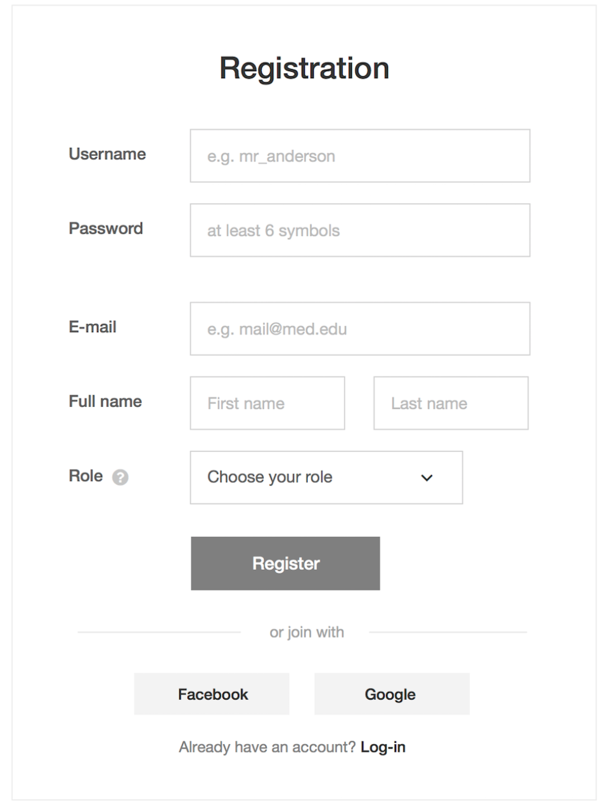

# QA Test Cases Assessment

Please Create a Test Plan to User Registration based on Screenshot and Acceptance Criteria.
Test Plan must be created using Excel. We will evaluate test coverage and organization
during assessment of your test plan.

## Acceptance Criteria:

- Ability to enter valid and unique email address, otherwise receive an error "Invalid Email or already taken"
- Ability to enter valid password and login, otherwise receive an error "Invalid Password"
- Ability to enter valid and unique Username, otherwise receive an error "Invalid Username or already taken"
- Ability to enter First Name, otherwise receive an error "First Name can not be blank"
- Ability to enter Last Name, otherwise receive an error "Last Name can not be blank"
- Ability to select Role from the list of available options. If no selection is made receive an error "Role can not be blank"
- Ability to configure system option for User Role and define list values. Initial list:
-- Surgeon
-- Nurse
-- Scrub Technician
-- Anesthesiologist
-- Trainee
-- Hospital Administrator
- Ability to press "Register" without selecting "Setup new organization" to login user and go to User Dashboard
- Ability select "Setup new organization" and press "Register" to login user and go to Organization Admin: Create
Organization
- Ability to press " Log-in" to go to User Login: Sign In
Bells and Whistles acceptance:
- Ability to register with Facebook account
- Ability to register with Google account
- Ability to confirm email

